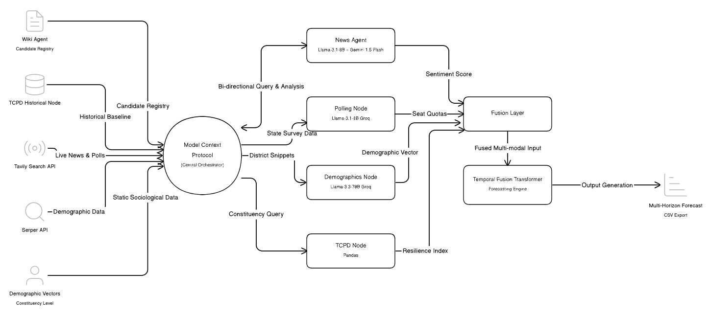

# Multi-Horizon Generative Election Forecasting Engine

> A seat-by-seat AI prediction pipeline for Indian State Assembly Elections, built on a Multi-Agent MCP (Model Context Protocol) architecture.



---

## What This Is

This is not a poll aggregator. It is a **generative forecasting engine** that simulates election outcomes at the constituency level by fusing three distinct intelligence layers:

- **40 years** of historical TCPD electoral data (the long-term memory)
- **Live AI sentiment analysis** across 824 seats via Gemini 2.5 Flash (the real-time signal)
- **Macro polling targets** synthesized from live surveys via Groq (the strategic compass)

The system covers **824 constituencies across 5 Indian states** — Assam, Kerala, Puducherry, Tamil Nadu, and West Bengal — and produces a seat-by-seat prediction CSV with confidence scores, risk labels, and swing indices per constituency.

---

## System Architecture

The pipeline runs as a **linear multi-agent sequence** orchestrated by `scripts/run_predictions.py`. Agents communicate via structured JSON payloads through an MCP-inspired central state map.


## Agent Nodes

### 1. `tcpd_node.py` — Historical Baseline Node
- **Engine:** Pandas DataFrame (no LLM)
- Ingests TCPD CSVs (1980–2021) for all 5 states
- Computes rolling average margins, voter turnout volatility, runner-up history, and party loyalty scores (consecutive win counts)
- Provides the "ground truth" baseline that anchors all subsequent predictions

### 2. `polling_node.py` — Macro Targeting Node
- **Engine:** Llama-3.1-8B-Instant (Groq) + Tavily Search
- Searches for live state-wide opinion polls and survey data
- Extracts structured seat quotas and demographic wave targets per alliance
- Outputs the strategic "North Star" seat targets that the swing model must satisfy

### 3. `gemini_news_agent.py` — Sentiment Node
- **Engine:** Gemini 1.5 Flash (primary) + Llama-3.1-8B on Groq (fallback)
- Runs parallel async sentiment sweeps across all 824 constituencies
- Executes in batches of 5 via `asyncio.gather` to maximize throughput within API rate limits
- Produces a sentiment score per seat ranging from -1.0 (extreme anti-incumbency) to +1.0 (pro-incumbency wave)
- Also flags risk events: scandals, protests, candidate defections

### 4. `demographic_node.py` — Demographics Node
- **Engine:** Llama-3.3-70B-Versatile (Groq) + Serper API
- Retrieves district-level demographic vectors: Rural/Urban ratio, SC/ST population density, literacy rate
- Maps Census data to current constituency boundaries
- Outputs structural demographic vulnerability adjustments per seat

### 5. `fusion_layer.py` — Signal Fusion Node
- No external LLM; pure transformation logic
- Normalizes all incoming signals (strings, floats, categorical labels) into a unified multi-dimensional feature vector
- Maps every constituency to a complete political signal profile before passing to the solver

### 6. `swing_model.py` — Macro-Allocation Solver
- The mathematical core of the system
- Computes a **Vulnerability Index** per seat:
  ```
  Vulnerability = Margin + (Sentiment × Multiplier) + Loyalty_Bonus - Demographic_Wave
  ```
- Ranks all seats by vulnerability and flips them in order until state-wide polling targets are met
- Implements **Historical Gravity**: news sentiment is mathematically damped by each seat's Resilience Index (Margin + Loyalty) to prevent unrealistic flips driven purely by media hype
- Applies **State-Specific Political Personas** that modify solver behavior per state (e.g., Kerala bipolar floor, West Bengal cadre resilience multiplier)

### 7. `political_model.py` — ML Risk Expert System
- A fine-tuned **Gradient Boosting Classifier** trained on TCPD time-series data
- Reads historical wave signals (turnout spikes, margin collapse patterns) combined with live sentiment scores
- Outputs classification labels: `SAFE HOLD`, `POSSIBLE FLIP`, `LIKELY FLIP`, `CRITICAL TOSS-UP`
- Also outputs a 0–10 volatility score per constituency

### 8. `tft_engine/` — Temporal Fusion Transformer
- A deep learning sequence-to-sequence model built with PyTorch Lightning
- Performs probabilistic quantile forecasting purely from time-series historical electoral dynamics
- Provides a secondary forecast horizon independent of the live sentiment pipeline

---

## Data Sources

| Source | Type | What It Provides |
|--------|------|-----------------|
| TCPD CSVs (1980–2021) | Static | Historical margins, turnout, party loyalty |
| `candidates_2026.csv` | Static | 1,345 candidates, parties, alliance mappings |
| Tavily Search API | Real-time | Regional news, opinion polls, local political events |
| Serper API | Real-time | District-level demographic data |
| Wikipedia | Real-time | Candidate metadata and 2026 constituency registry |

---

## Scale & Performance

| Metric | Value |
|--------|-------|
| States covered | 5 (Assam, Kerala, Puducherry, Tamil Nadu, West Bengal) |
| Constituencies | 824 |
| Candidates tracked | 1,345 |
| API calls per run | ~3,000+ |
| Execution time | 15–20 minutes |
| Concurrency model | `asyncio.gather` in batches of 5 |
| Output features | 30+ columns per constituency |

---

## Output Schema

Final predictions are written to `predictions/election_predictions_2026.csv`.

| Column | Description |
|--------|-------------|
| `state` | State name |
| `constituency` | Constituency name |
| `predicted_winner_party_2026` | Predicted winning party |
| `winning_margin_pct` | Predicted margin percentage |
| `ml_risk_level` | Classification label |
| `party_loyalty` | Consecutive win count for incumbent |
| `swing_index` | Magnitude of predicted swing |
| `prediction_confidence` | Model confidence score |

**Risk classification labels:** `SAFE HOLD` → `POSSIBLE FLIP` → `LIKELY FLIP` → `CRITICAL TOSS-UP`

---

## Prerequisites

```bash
pip install -r requirements.txt
```

Create a `.env` file in the project root with the following keys:

```env
GROQ_API_KEY=your_key_here
GEMINI_API_KEY=your_key_here
TAVILY_API_KEY=your_key_here
SERPER_API_KEY=your_key_here
```

---

## How to Run

### Step 1 — Validate the Pipeline
Checks all CSVs parse correctly and no mathematical impossibilities exist (e.g., margins > 100%).

```bash
python scripts/validate_pipeline.py
```

### Step 2 — Train the Expert Model
Re-trains the Gradient Boosting classifier on TCPD historical data using time-series shifting.

```bash
python scripts/train_political_model.py
```

Saves model weights to `agents/political_risk_model.pkl`.

### Step 3 — Run the Full Prediction
Pulls all 824 constituencies, triggers the live Gemini sentiment sweep, runs the swing model solver, and generates the final prediction spreadsheet.

```bash
python scripts/run_predictions.py
```

---

## Project Structure

```
├── agents/
│   ├── tcpd_node.py               # Historical baseline agent
│   ├── polling_node.py            # Live poll synthesis agent
│   ├── gemini_news_agent.py       # Sentiment analysis agent
│   ├── demographic_node.py        # Demographics enrichment agent
│   ├── fusion_layer.py            # Signal fusion and normalization
│   ├── swing_model.py             # Macro-allocation solver
│   ├── political_model.py         # ML risk classifier
│   ├── political_risk_model.pkl   # Trained model weights
│   └── data/                      # TCPD historical CSVs (1980–2021)
│
├── tft_engine/                    # Temporal Fusion Transformer components
│
├── scripts/
│   ├── run_predictions.py         # Main orchestrator — run this
│   ├── train_political_model.py   # Model training script
│   └── validate_pipeline.py       # Pre-run validation checks
│
├── predictions/
│   ├── election_predictions_2026.csv   # Final seat-by-seat output
│   └── *.json                          # State-level JSON summaries
│
├── img/
│   └── system_design_n.png        # Architecture diagram
│
├── candidates_2026.csv            # 2026 candidate registry (1,345 entries)
├── wiki_static_meta.json          # Cached constituency metadata
├── .env                           # API keys (not committed)
└── requirements.txt
```

---

## Roadmap & Planned Improvements

**Data Layer**
- Integrate 2024 Lok Sabha assembly-segment results as a weighted baseline `(LS2024 × 0.60) + (TCPD2021 × 0.40)` for fresher signals
- Upgrade demographic node from Census 2011 to Census 2021 data

**Swing Model**
- Replace hardcoded `ANTI_INCUMBENCY_STRENGTH` with a tenure-decay function — longer incumbents face exponentially higher pressure
- Recalibrate `cadre_dominance` for West Bengal post-2024 LS results
- Split Kerala's `bipolar_floor` into separate challenger/incumbent floors with a 40-year alternation pattern bonus
- Make `UNFLIPPABLE_THRESHOLD` dynamic based on pollster consensus count instead of a fixed 20.0
- Invert `loyalty_bonus` for 10+ year incumbents — loyalty becomes a complacency penalty, not a protection score

**Sentiment & Fusion**
- Dual-query sentiment: challenger signal minus incumbent signal instead of a single generic query per constituency
- Add candidate continuity scoring — same MLA re-contesting is significantly harder to flip than a fresh candidate
- Fix coalition majority validation bug in `classify_alliance()`

**Output**
- Replace single-point seat predictions with a confidence range: `seats_min`, `seats_central`, `seats_max` per alliance per state

---

